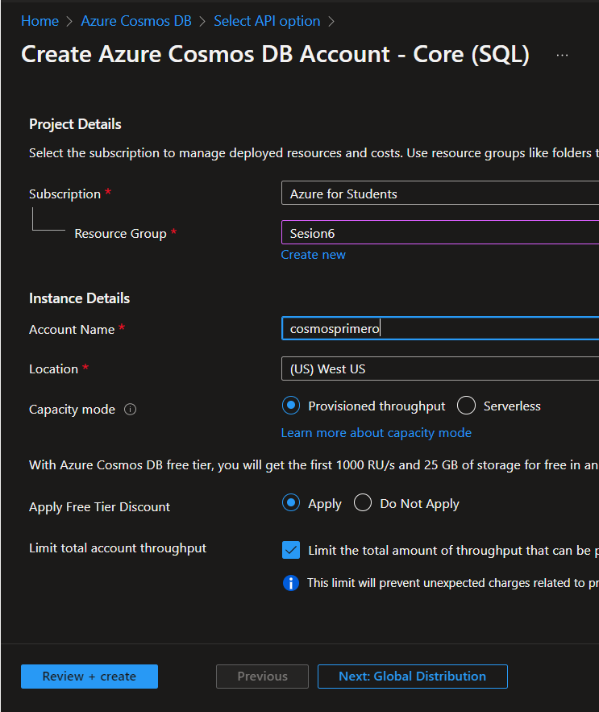
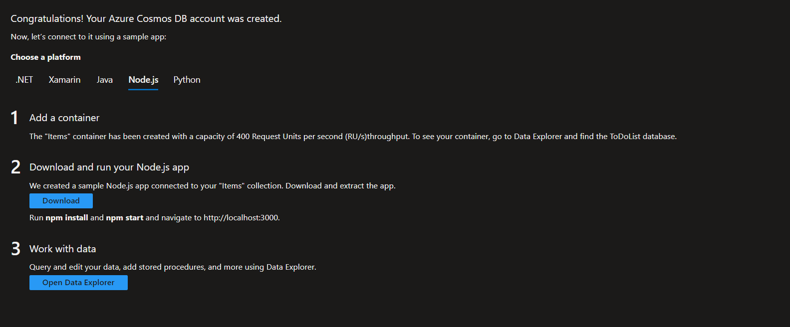
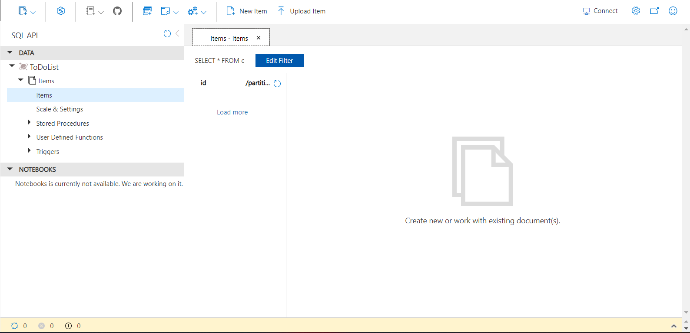
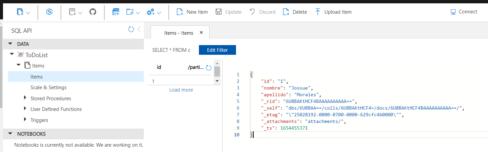

# Como crear un COSMOS DB en Azure

- Primero debemos ir a la pagina de [Portal azure](https://portal.azure.com/#home) y buscar COSMOS DB y crear escojiendo "Core SQL" llenando los datos que nos piden:

Una ves creado el recurso dentro del mismo podremos escojer el tipo de lenguaje de programacion que queramos, tambien podremos descargar el item para comsumir el archivo; pero en nuestro caso clickearemos en "Abrir el explorador de datos

Una ves dentro del item podremos ingresar los datos que queramos dependiendo del lenguaje de programacion que escojimos anteriormente1:

